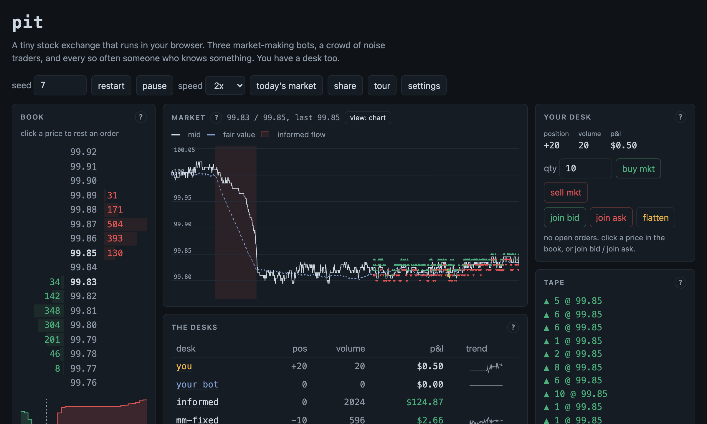

# pit

[](https://github.com/prathammukewar/pit/actions/workflows/ci.yml)

A tiny exchange that runs in your browser: a real limit order book matching
engine written in Rust, compiled to WebAssembly, with three market makers, a
crowd of noise traders, and an occasional informed trader who knows where the
price is going before everyone else.

**Live demo: [prathammukewar.github.io/pit](https://prathammukewar.github.io/pit)**

[](https://prathammukewar.github.io/pit/)

That shaded band on the chart is an informed trader unloading before a drop
they saw coming. The white line is the traded mid; the dashed line is the
hidden fair value it is chasing.

You get a desk too. Click the book to rest limit orders, hit the market
buttons, and see if you can stay ahead of the bots. Runs are deterministic:
the same seed always produces the same market, tick for tick, so any run can
be replayed by sharing its URL.

## Why this exists

I wanted to see adverse selection happen instead of reading about it. The
demo is built around one idea: market makers earn the spread from uninformed
flow and lose it to informed flow, and how they handle that is most of what
separates them.

So the sim has a hidden fair value following a random walk, and every so
often an informed trader shows up who can see where it is headed. The three
makers respond differently:

* **mm-fixed** quotes a constant spread around the mid. It has no idea the
  informed trader exists.
* **mm-skew** shifts its quotes against its inventory, the textbook first
  step (the idea dates to Avellaneda and Stoikov's 2008 paper, though this
  version is a linear skew, not the closed-form solution).
* **mm-wary** skews too, and also watches signed order flow and short-term
  volatility against their long-run baselines. When flow turns one-sided it
  widens, and past a threshold it pulls its quotes entirely.

Over a long session mm-fixed bleeds, and while mm-skew and mm-wary both end
up green, mm-wary gets there on a quarter of the volume, which means it
earns several times more per lot traded. The edge is in choosing which
fills to take. Nothing scripts that outcome; it falls out of who gets picked
off during the shaded stretches. Here is a 500k-tick run on seed 7:

```
seed 7, 500000 ticks, 208 informed episodes, 51 halts
462132 trades, 1829731 lots, avg spread 1.87 ticks, final mid 98.72

desk             volume      pos      pnl ($)
informed         347657      223     23656.56
mm-fixed         100184      -40      -314.12
mm-skew          139913        5       284.81
mm-wary           34634       -6       220.85
noise crowd     3037074     -182    -23848.11
```

Those 51 halts are the circuit breaker: a violent enough move stops trading
for a stretch and purges every resting order, the way limit-up/limit-down
rules do on real venues. Fair value keeps drifting while the tape is
frozen, so reopens gap, and quoting into a reopen is its own way to learn
about adverse selection.

The noise crowd pays for everything, which is also the textbook answer to
who funds the market making industry.

## Playing it

The demo runs itself, but it is more fun as a participant. Set a quantity on
your desk, then click a price in the book to rest a limit order there: the
green side buys, the red side sells. The market buttons cross the spread
immediately, join bid and join ask rest a limit at the touch, and flatten
markets out of your whole position. Open orders sit under your desk with a
cancel button, your fills print on the tape tagged "you", and your P&L is
marked to the mid. Pause with the button or the space bar, use the speed
control to fast forward through quiet stretches, and use share to copy a
link that replays the run you are watching.

The market panel can swap its price chart for a book heatmap (time across,
price down, resting size as brightness), which is the view that shows
liquidity pulling away before a move. Two dials in the header scale the
calm volatility and how often the informed trader shows up; everything was
tuned at 1x, and the other settings exist for watching the desks suffer.

The page has a light theme and a blue/orange palette for anyone who can't
separate red from green, and buys and sells are also shape-coded (up and
down marks) so the side never rides on color alone. Everything works from
the keyboard, including resting orders in the book.

Two trades worth trying. In a calm stretch, rest a buy a couple of ticks
below the mid and a sell a couple above, and earn the spread the way the
makers do. And when the chart shades, read the direction off the tape, take
that side with a market order, and flatten when the shading stops. If you
instead leave resting quotes out through an episode, you will find out
personally what adverse selection costs, which is the lesson the whole sim
is built around.

## Or skip the clicking and write a bot

The bot lab at the bottom of the page takes a JavaScript strategy and hires
it onto the floor as a real desk. It runs once per tick through the same
matching engine as everything else, appears in the desks table as "your bot"
with its own p&l and sparkline, and gets fired on its first uncaught
exception, which feels about right. A strategy is just a function body:

```js
// quote both sides at the touch, size 5
const size = 5;
let haveBid = false, haveAsk = false;
for (const o of view.orders) {
  const stale = (o.side === 'buy' && o.price !== view.bid) ||
                (o.side === 'sell' && o.price !== view.ask);
  if (stale) { api.cancel(o.id); continue; }
  if (o.side === 'buy') haveBid = true; else haveAsk = true;
}
if (!haveBid && view.bid) api.limit('buy', view.bid, size);
if (!haveAsk && view.ask) api.limit('sell', view.ask, size);
```

You get `view` (top of book and depth, position, your orders, this tick's
trades), `api` (limit, market, cancel, capped at 6 actions a tick), and a
`state` object that survives between ticks. There are presets to start
from, including exactly the naive quoter above so you can watch yourself
get adversely selected.

When the strategy feels ready, hit "run a season": it backtests your exact
code against 100,000 ticks of a fresh copy of the current seed, headless,
in about a second, and reports every desk's p&l, your p&l per lot, your max
drawdown, a Sharpe-ish ratio, and an equity curve of your bot racing
mm-wary. It also runs the same market once more without you, so the report
can say what your presence did to mm-wary's p&l. Two more buttons do the
things a careful person would do next. "Latency ladder" reruns the season
with your bot 0, 2, 5, 10, and 25 ticks behind the market (your view goes
stale by that much while your orders still land on the live book), and
puts a dollar figure on what speed is worth to your strategy. "Seed sweep"
reruns it across eight seeds and reports the win rate against mm-wary with
the mean, worst, and best outcomes, because one seed can flatter anyone.

"Share bot" copies a link that carries your code and seed, so anyone who
opens it gets your exact bot and can rerun your exact season. The standing
challenge: beat mm-wary across a sweep without reading anything the other
desks can't see. The "today's market" button gives everyone on earth the
same seed for the day, if you want a fair fight to compare on.

## The engine

`engine/` is a standalone price-time priority matching engine with no
dependencies. Limit, market, and immediate-or-cancel orders, cancels, partial
fills, and self-match prevention (cancel-oldest, the same policy several real
exchanges offer). Prices are integer ticks, quantities integer lots, and the
matching loop allocates nothing in steady state.

The book is two `BTreeMap`s of FIFO queues plus an id index for cancels. A
production engine would use flatter structures, but this keeps the code
readable, and it is fast enough that the browser sim spends most of its time
elsewhere: criterion measures 13 to 15 million operations per second (about
70ns each) on an Apple M4, on a mixed workload of limits near the touch,
cancels, and market orders. Inside the browser, a full sim tick, which
includes all 24 agents deciding and acting, runs in about 0.9 microseconds.

Correctness is tested two ways:

* unit tests for the matching semantics you would expect (FIFO within a
  level, price improvement goes to the taker, IOC never rests, and so on),
* a differential test that replays 200k random operations through the engine
  and through a 100-line brute-force reference book, and asserts the two
  produce identical event streams. The reference is slow and too simple to
  be wrong, which is the point. If they ever disagree, the failing seed
  prints so the case can be replayed.

## The sim

`sim/` puts a market on the engine. Twenty noise traders fire limit and
market orders with a weak lean toward fair value, which is what tethers the
price. The informed trader wakes up every couple of thousand ticks, trades
aggressively in the direction of the coming drift, then works its position
back to flat when the edge is gone. Randomness comes from one hand-rolled
PCG32, so a seed fully determines the run on every platform, including wasm.

The tuning constants in `sim/src/makers.rs` were arrived at by running
`cargo run --release --example session` across seeds and staring at the P&L
table until the dynamics looked like the microstructure story they are meant
to illustrate. They are not calibrated to any real market, and the point
survives reasonable retuning: whoever quotes tightest with the least
information pays the most.

## Running it

Native tests and benchmarks:

```
cargo test
cargo bench -p pit-engine
cargo run --release --example session -- 7 500000
```

The web frontend (needs [wasm-pack](https://rustwasm.github.io/wasm-pack/)):

```
wasm-pack build wasm --target web --release --out-dir ../web/pkg --no-typescript
python3 -m http.server -d web 8000
```

Then open http://localhost:8000. The frontend is plain ES modules and canvas;
there is no framework and no build step beyond the wasm.

## What it deliberately leaves out

There is no latency: every agent sees the book at the same instant, so there
is no queue racing and no speed advantage to model. There are no fees or
rebates, and only one instrument trades. The flow model is a toy, and the
informed trader's edge is artificial (it reads the future drift straight from
the simulator). Everything around the matching is simplified; the matching
itself is exact. Numbers coming out of the sim describe this sim and no real
market.

## Reading that pairs well with this

* Larry Harris, *Trading and Exchanges*, for the market structure vocabulary.
* Avellaneda and Stoikov, *High-frequency trading in a limit order book*
  (2008), for where mm-skew's idea comes from.
* The [LOBSTER](https://lobsterdata.com/) sample files, if you want to see
  what real order book data looks like next to this toy.

## License

MIT
